# Gallery

<table>
   <tr>
   <td align="center" width="45%">
      <br/>
    </td>
    <td align="center" width="45%">
      <br/>
    </td>
  </tr>
  <tr>
    <td align="center" width="45%">
      <br/>
    </td>
    <td align="center" width="45%">
      <br/>
    </td>
  </tr>
  <tr>
    <td align="center" width="45%">
      <br/>
    </td>
    <td align="center" width="45%">
      <br/>
    </td>
  </tr>
</table>


Browse all 54 available watchfaces for the e-paper watch project.

---

## Star Wars Collection

<table>
  <tr>
    <td align="center" width="33%">
      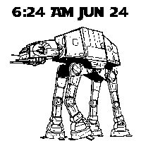<br/>
      <b>AT-AT</b>
    </td>
    <td align="center" width="33%">
      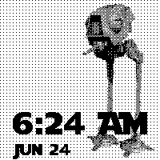<br/>
      <b>AT-DP</b>
    </td>
    <td align="center" width="33%">
      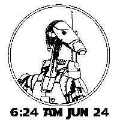<br/>
      <b>B1 Battle Droid</b>
    </td>
  </tr>
  <tr>
    <td align="center" width="33%">
      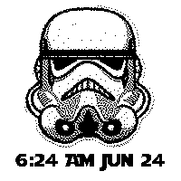<br/>
      <b>Stormtrooper 2</b>
    </td>
    <td align="center" width="33%">
      <br/>
      <b>Stormtrooper 3</b>
    </td>
    <td align="center" width="33%">
      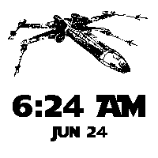<br/>
      <b>X-Wing</b>
    </td>
  </tr>
</table>

## Harry Potter Collection

<table>
  <tr>
    <td align="center" width="33%">
      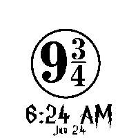<br/>
      <b>Harry Potter</b>
    </td>
    <td align="center" width="33%">
      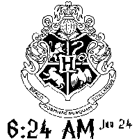<br/>
      <b>Hogwarts</b>
    </td>
    <td align="center" width="33%">
      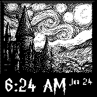<br/>
      <b>Hogwarts 2</b>
    </td>
  </tr>
  <tr>
    <td align="center" width="33%">
      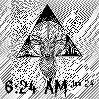<br/>
      <b>Hogwarts 3</b>
    </td>
    <td align="center" width="33%">
      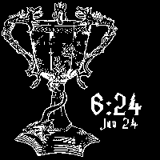<br/>
      <b>Hogwarts 4</b>
    </td>
    <td align="center" width="33%">
      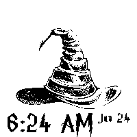<br/>
      <b>Sorting Hat</b>
    </td>
  </tr>
</table>

## Club Penguin Collection

<table>
  <tr>
    <td align="center" width="33%">
      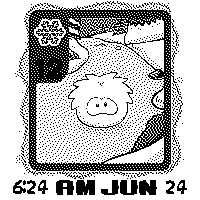<br/>
      <b>Card Jitsu 1</b>
    </td>
    <td align="center" width="33%">
      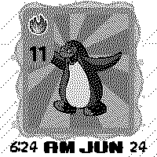<br/>
      <b>Card Jitsu 2</b>
    </td>
    <td align="center" width="33%">
      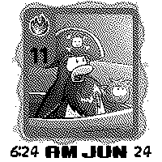<br/>
      <b>Card Jitsu 3</b>
    </td>
  </tr>
  <tr>
    <td align="center" width="33%">
      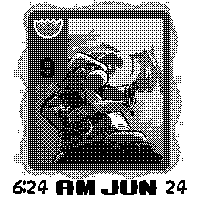<br/>
      <b>Card Jitsu 4</b>
    </td>
    <td align="center" width="33%">
      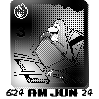<br/>
      <b>Card Jitsu 5</b>
    </td>
    <td align="center" width="33%">
      <br/>
      <b>Sensei</b>
    </td>
  </tr>
  <tr>
    <td align="center" width="33%">
      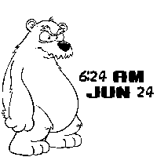<br/>
      <b>Herbert</b>
    </td>
  </tr>
</table>

## Animals & Nature

<table>
  <tr>
    <td align="center" width="33%">
      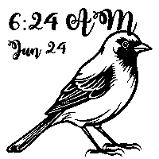<br/>
      <b>Bird</b>
    </td>
    <td align="center" width="33%">
      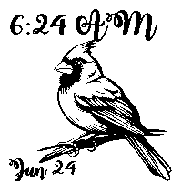<br/>
      <b>Bird 2</b>
    </td>
    <td align="center" width="33%">
      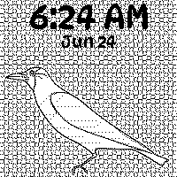<br/>
      <b>Crow</b>
    </td>
  </tr>
  <tr>
    <td align="center" width="33%">
      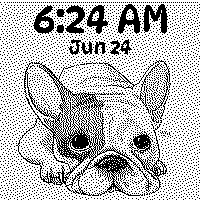<br/>
      <b>Dog</b>
    </td>
    <td align="center" width="33%">
      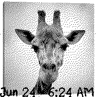<br/>
      <b>Giraffe</b>
    </td>
    <td align="center" width="33%">
      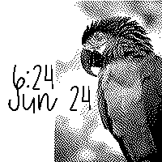<br/>
      <b>Macaw</b>
    </td>
  </tr>
  <tr>
    <td align="center" width="33%">
      <br/>
      <b>Peacock</b>
    </td>
    <td align="center" width="33%">
      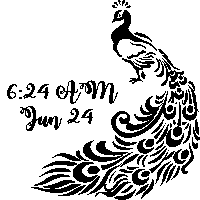<br/>
      <b>Peacock 3</b>
    </td>
    <td align="center" width="33%">
      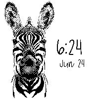<br/>
      <b>Zebra</b>
    </td>
  </tr>
</table>

## Other Characters

<table>
  <tr>
    <td align="center" width="33%">
      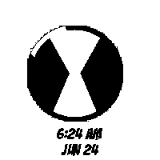<br/>
      <b>Ben 10</b>
    </td>
    <td align="center" width="33%">
      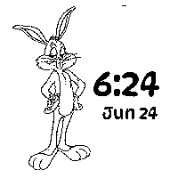<br/>
      <b>Bugs Bunny</b>
    </td>
    <td align="center" width="33%">
      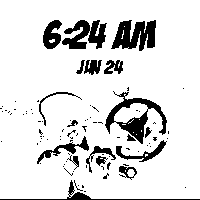<br/>
      <b>Claw</b>
    </td>
  </tr>
  <tr>
    <td align="center" width="33%">
      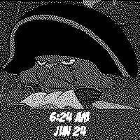<br/>
      <b>Claw 2</b>
    </td>
    <td align="center" width="33%">
      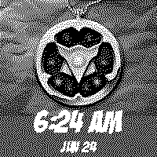<br/>
      <b>Claw 3</b>
    </td>
    <td align="center" width="33%">
      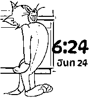<br/>
      <b>Tom (Tom & Jerry)</b>
    </td>
  </tr>
  <tr>
    <td align="center" width="33%">
      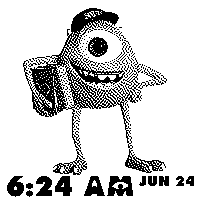<br/>
      <b>Mike Wazowski</b>
    </td>
    <td align="center" width="33%">
      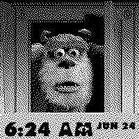<br/>
      <b>Sulley</b>
    </td>
    <td align="center" width="33%">
      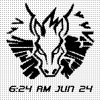<br/>
      <b>Pegasus</b>
    </td>
  </tr>
  <tr>
    <td align="center" width="33%">
      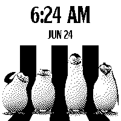<br/>
      <b>Penguins of Madagascar</b>
    </td>
    <td align="center" width="33%">
      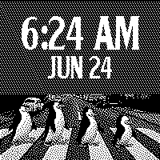<br/>
      <b>Penguin Beatles</b>
    </td>
    <td align="center" width="33%">
      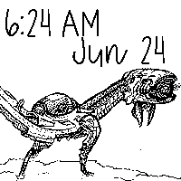<br/>
      <b>Walker (Horizon Zero Dawn)</b>
    </td>
  </tr>
</table>

## Music & Entertainment

<table>
  <tr>
    <td align="center" width="33%">
      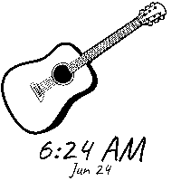<br/>
      <b>Guitar 1</b>
    </td>
    <td align="center" width="33%">
      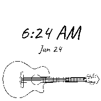<br/>
      <b>Guitar 2</b>
    </td>
    <td align="center" width="33%">
      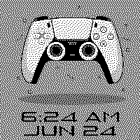<br/>
      <b>PlayStation</b>
    </td>
  </tr>
</table>

## Nature & Landscapes

<table>
  <tr>
    <td align="center" width="33%">
      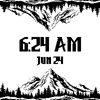<br/>
      <b>Mountain 1</b>
    </td>
    <td align="center" width="33%">
      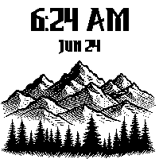<br/>
      <b>Mountain 2</b>
    </td>
    <td align="center" width="33%">
      <br/>
      <b>Tree</b>
    </td>
  </tr>
  <tr>
    <td align="center" width="33%">
      <br/>
      <b>Planets</b>
    </td>
    <td align="center" width="33%">
      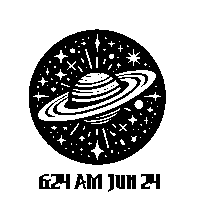<br/>
      <b>Saturn</b>
    </td>
  </tr>
</table>

## Cultural & Spiritual

<table>
  <tr>
    <td align="center" width="33%">
      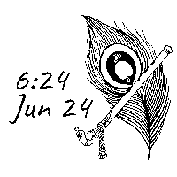<br/>
      <b>Krishna</b>
    </td>
    <td align="center" width="33%">
      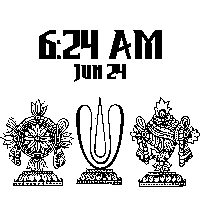<br/>
      <b>Thiruman</b>
    </td>
    <td align="center" width="33%">
    </td>
  </tr>
</table>

## Abstract & Patterns

<table>
  <tr>
    <td align="center" width="33%">
      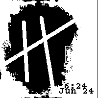<br/>
      <b>haricane8133</b>
    </td>
    <td align="center" width="33%">
      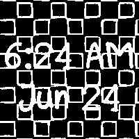<br/>
      <b>Squares</b>
    </td>
    <td align="center" width="33%">
      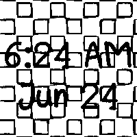<br/>
      <b>Squares Inverted</b>
    </td>
  </tr>
  <tr>
    <td align="center" width="33%">
      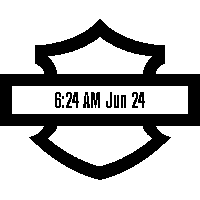<br/>
      <b>Harley Davidson</b>
    </td>
  </tr>
</table>

---

## Creating Your Own Watchface

Want to add your own watchface? Check out the [Python tools documentation](README-STANDARD.md#creating-custom-watchfaces) for step-by-step instructions!

### Quick Start

```bash
cd watchfaceutils
python3 configure_watchface.py
```

The interactive tool will guide you through:
1. Selecting your artwork
2. Choosing fonts
3. Positioning text
4. Generating C++ code
5. Creating preview images

---

## Technical Details

- **Display**: 200x200 pixels, 1-bit monochrome
- **Format**: Percentage-based positioning (0-100%)
- **Fonts**: 66 custom fonts included
- **Layout Modes**: Single-line and two-line text layouts
- **Refresh**: Partial (fast) and full (ghosting-free) modes

For complete API documentation, see [README-DETAILED.md](README-DETAILED.md#watchface-class-structure).

---

**Total Watchfaces**: 54 and growing! 🎨
